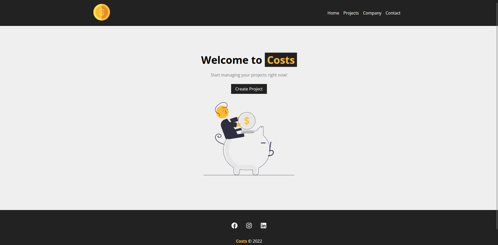
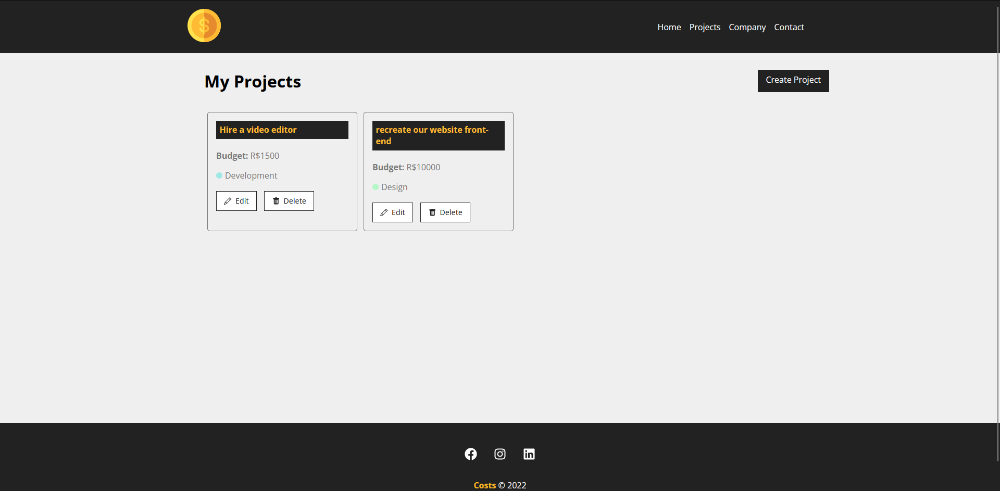
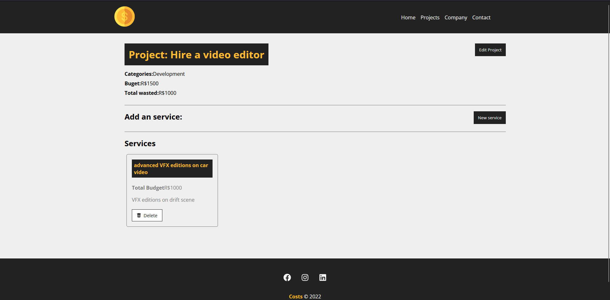

# Welcome to React Costs

## About the Project:

React Costs was my first project in ReactJS, i made it in 2022 to get my first step in the framework.
The main objective is manage your projects, setting budgets, creating services and applying costs to each service.

<b>Note: This project was created by <a href="https://github.com/matheusbattisti">Matheus Battisti</a> from <a href="https://www.youtube.com/@MatheusBattisti">Hora de Codar</a></b>

## Project Layout:

### Home page:

### Projects page:

### Services page:

## What can i learn accomplishing this project:

<ul>
  <li>Creating first react application</li>
  <li>React Components</li>
  <li>React Props</li>
  <li>Events</li>
  <li>React Hooks</li>
  <li>React Icons</li>
  <li>React Router</li>
  <li>Adapt react router to v6</li>
  <li>State Life</li>
  <li>data manipulation with API</li>
</ul>
